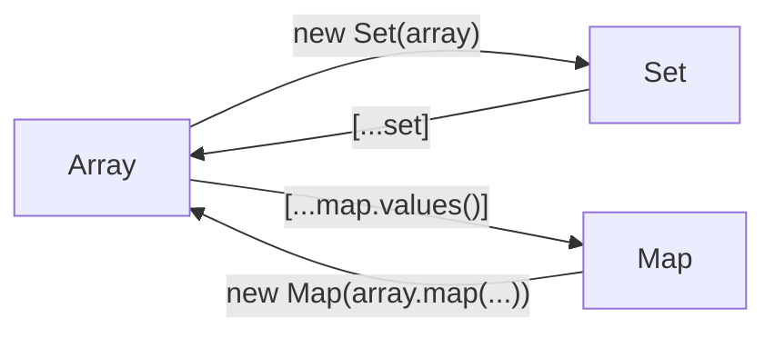

---
# You can also start simply with 'default'
theme: ../theme
# random image from a curated Unsplash collection by Anthony
# like them? see https://unsplash.com/collections/94734566/slidev
background: https://images.unsplash.com/photo-1621237023000-6a628c285938?q=80&w=3270&auto=format&fit=crop&ixlib=rb-4.0.3&ixid=M3wxMjA3fDB8MHxwaG90by1wYWdlfHx8fGVufDB8fHx8fA%3D%3D
# some information about your slides (markdown enabled)
title: JavaScript API
info: |
  Created with [Sli.dev](https://sli.dev)
# apply unocss classes to the current slide
class: text-center
# https://sli.dev/features/drawing
drawings:
  persist: false
# slide transition: https://sli.dev/guide/animations.html#slide-transitions
transition: fade-out
# enable MDC Syntax: https://sli.dev/features/mdc
mdc: true

---

# JavaScript API { .!text-yellow-100}

蓝桥杯Web组 省赛备赛 {.!text-white/50}

---

## JavaScript 学习资源

[MDN](https://developer.mozilla.org/zh-CN/docs/Web/JavaScript)

[JavaScript 权威指南](https://github.com/apachecn/JavaScript-The-Definitive-Guide-7th-zh)


---


## JavaScript速览

<v-clicks>

1. JavaScript是一门**动态、解释性**编程语言，非常适合**面向对象和函数式编程**风格。

2. 核心JavaScript定义了最小限度的API，用于操作数值、文本、数组、Map、Set等。

3. **浏览器**是JavaScript最早的运行环境；**Node.js**是JavaScript的另一个运行环境，给予了JavaScript访问整个操作系统的权限。

4. JavaScript类型可以分为**原始类型（Number、String、Boolean、null、undefined、Symbol）和对象类型（Array、Set、Map、RegExp、Date等）**。

5. JavaScript有一个灵活而被诟病的**自动转换规则**。

</v-clicks>

---
  
## `Number`

<v-clicks>

### 数学计算 {.!mt-6}

```js{hide|1|2|3|4|5|6|7|8|9|all}
Math.round(1.5) // 2
Math.fround(1.5) // 1.5，舍入到最接近的32位浮点数
Math.ceil(1.1) // 2
Math.floor(1.9) // 1
Math.sqrt(4) // 2
Math.pow(2, 10) // 1024
Math.random() // 0.0 ~ 1.0
Math.max(1, 2, 3) // 3
Math.min(1, 2, 3) // 1
```

### 上溢出？下溢出？被零除？ {.!mt-6}

```js{hide|1|2|3|4|5|6|all}
Number.MAX_VALUE // 1.7976931348623157e+308
Number.MIN_VALUE // 5e-324
Number.isNaN(x)
Number.isFinite(x)
Number.isInteger(x)
Number.isSafeInteger(x)
```

</v-clicks>

---
   
## `String`

::my
::

```js{hide|1|1-2|1-3|1-4|1,5|1,5-6|1,5-7|1,5-8|all}
let str = 'hello world';
str.length // 11
str[0] // 'h'
str[str.length - 1] // 'd'
str.substring(0, 5) // 'hello'，
str.slice(0, 5) // 'hello'
str.slice(6) // 'world'，默认截取到结尾
str.slice(-1)  // 'd'，支持负数
```

```js{hide|1|1,2,3|1,4|1,5,6|all}
let str = 'hello world';
str.indexOf('world') // 6
str.lastIndexOf('o') // 7
str.includes('hello') // true
str.startsWith('hello') // true
str.endsWith('world') // true
```

```js{hide|all}
let str = 'hello world';
str.toUpperCase() // 'HELLO WORLD'
str.toLowerCase() // 'hello world'
```

---

## `String`

::my
::

```js{hide|1,2|1,3|all}
let str = 'hello world';
str.split(' ') // ['hello', 'world']
str.replace('world', 'javascript') // 'hello javascript'
```

```js{hide|all}
let str = ' hello world ';
str.trim() // 'hello world'
str.trimStart() // 'hello world '
str.trimEnd() // ' hello world'
```

```js{hide|1-3|5|all}
"x".padStart(3, "*") // '**x'
"x".padEnd(3, "*") // 'x**
"x".padStart(3) // '  x'

"<>".repeat(3) // '<><><>'
```


---

## `Boolean`

::my
::


```js{hide|1|2|3|4|5|6|7|8|9|all}
Boolean(0) // false
Boolean(NaN) // false
Boolean('') // false
Boolean(null) // false
Boolean(undefined) // false
Boolean([]) // true!!!
Boolean({}) // true!!!
Boolean(' ') // true
Boolean('false') // true
```

---

## 原始值类型转换

<v-clicks>

隐式的类型转换：

```js{hide|all}
x + ""   // String(x)
`${x}`   // String(x), recommended
+x         // Number(x)
!!x        // Boolean(x)
```

显式的类型转换：

```js{hide|all}
String(x)
Number(x)
Boolean(x)
```

在每次进行类型转换时，都需要**想一下`undefined`和`null`**！

控制数字转字符串的格式：

```js{hide|1|1,2|1,3|1,4|all}
let num = 123456.789;
num.toFixed(2) // "123456.79"
num.toPrecision(5) // "1.2346e+5"
num.toExponential(2) // "1.23e+5"
```

</v-clicks>

---

## `Object`

```js{hide|1,2,3,17|1,2,3,17,19|1,2,3,17,20|1,2,3,17,21|1,2,3,17,20-22|1,2,3,17,20-23|1,2,3,17,20-24|1,4-6,17|1,7-9,17|1,4-6,7-9,17|1,10,17|1,2,11-16,17|all}{lines:true}
let obj = {
  name: 'Alice',
  age: 18,
  sayHello: function() {
    console.log('Hello, my name is ' + this.name);
  },
  sayHello2() {  // 简写语法
    console.log('Hello, my name is ' + this.name);
  },
  ['key' + '1']: 'value1',  // 方括号里支持 JavaScript 表达式
  get info() {
    return this.name + ' ' + this.age;
  },   // getter, 计算属性
  set setName(name) {
    this.name = name;
  }    // setter
}

obj.name // 'Alice'
obj.age.length  // undefined
"xxx" in obj  // false
obj.xxx.length  // Error
obj?.xxx?.length  // 可空属性访问，undefined
obj?.xxx?.length ?? 0  // 默认值
```

---

## `Array`

::my
::


⚠ **数组是一种对象**，其下标是一种特殊的**对象属性**，这可以解释很多JavaScript数组与其他语言不同的语法特性。

```js{hide|1-2|1-4|1-5|1-6|8|8-10|12|14|14-15|all}{lines:true}
let arr = [1, , , 2]
arr.length // 4

arr[0]  // 1
arr[-1]  // undefined
arr[10]  // undefined

arr = new Array(10)
arr.length // 10
arr[0]  // undefined

Array.of(1, 2, 3) // [1, 2, 3]

Array.from('hello') // ['h', 'e', 'l', 'l', 'o']
[...'hello'] // the same
```

---

## `Array`的就地操作

::my
::

<v-clicks>

- `push(item)`: 末尾添加元素。
- `pop()`: 删除并返回末尾元素。

使用`push`和`pop`可以模拟栈。

- `unshift(item)`: 开头添加元素。
- `shift()`: 删除并返回开头元素。

使用`push`和`shift`可以模拟队列。

- splice(loc)：删除从索引`loc`开始的所有元素。
- splice(loc, count)：切出从索引`loc`开始的`count`个元素。
- splice(loc, count, ...items): 在切出元素的基础上，在`loc`位置插入元素。

⚠ 这几个方法都是对数组的**就地操作**，会改变原数组但不会返回原数组。

</v-clicks>

---

## `Array`的其他操作

::my
::

<v-clicks>

- `slice(start, end)`: 返回从`start`到`end`（不包括`end`）的片段。

- `fill(item, start, end)`: 用`item`填充从`start`到`end`（不包括`end`）的片段。

- `sort(func)`：按照指定规则排序。默认按照字符串字典序排序。

```js{hide|1|2|1-2|3-6|all}
[1, 2, 3].sort((a, b) => a - b) // [1, 2, 3]
[1, 2, 3].sort((a, b) => b - a) // [3, 2, 1]
[
  {name: "Alice", grade: 1}, 
  {name: "Bob", grade: 2}
].sort((a, b) => a.grade - b.grade) 
        // [{name: "Alice", grade: 1}, {name: "Bob", grade: 2}]
```

- `reverse()`：反转数组。

- `concat(...items)`: 返回新数组，新数组是原数组的副本，并在末尾添加`items`。

- `join(sep)`: 返回字符串，字符串由原数组的元素组成，元素之间用`sep`分隔。

</v-clicks>

---

## `Array`的迭代 🗡

::my
::

<v-clicks>

- `forEach(func)`: 对每个元素调用`func`。

- `map(func)`: 对每个元素调用`func`，返回新数组。

- `filter(func)`: 对每个元素调用`func`，返回新数组，其中只包含`func`返回`true`的元素。

- `reduce(func, init)`: 对每个元素调用`func`，`func`的返回值作为下一次调用`func`时的第一个参数，`init`是第一次调用`func`时的第一个参数。

</v-clicks>

<v-click>

````md magic-move

```js
// 生成一个长度为20的列表
new Array(20)
```


```js
// 生成一个1~20的列表
new Array(20)
    .map((_, idx) => idx + 1)
```

```js
// 生成一个1~20的列表，筛选出其中的奇数
new Array(20)
    .map((_, idx) => idx + 1)
    .filter(x => x % 2)
```

```js
// 生成一个1~20的列表，筛选出其中的奇数，然后求和
new Array(20)
    .map((_, idx) => idx + 1)
    .filter(x => x % 2)
    .reduce((a, b) => a + b, 0)
```
````

</v-click>

---

## `Set`

与数组不同的是，集合**没有索引或顺序，也不允许重复**：一个值要么是集合的成员，要么不是；不可能存在一个值在一个集合中出现多次。

```js
let set = new Set([1, 2, 3])
set.add(4)
set.delete(2)
set.has(3) // true
set.size // 2
```

::my
::

## `Map` 

`Map`对象保存键值对。任何值(对象或者原始值) 都可以作为一个键或一个值。

```js
let map = new Map()
map.set('name', 'Alice')
map.set('age', 20)
map.get('name') // 'Alice'
map.has('age') // true
map.delete('age')
map.size // 1
```

---

## 数组、集合和映射之间的转换

::my
::




---

